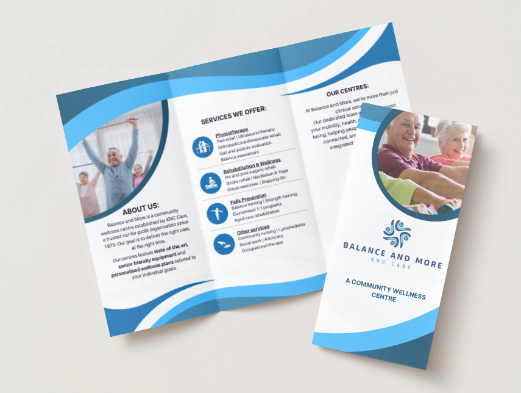
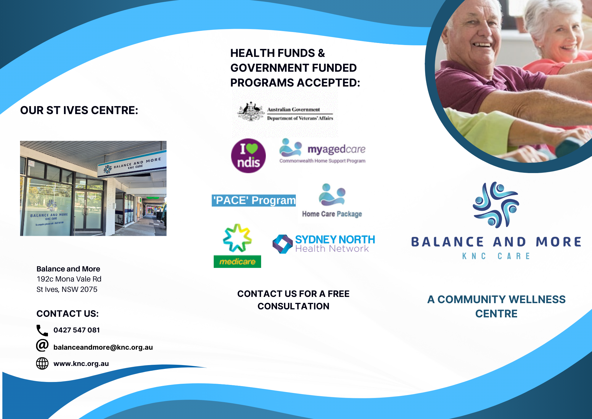
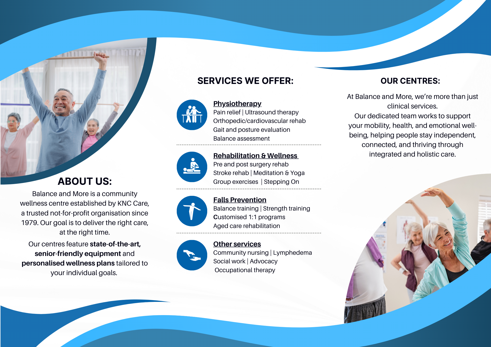

\# Balance and More – St Ives Trifold Brochure

This repository showcases a professionally designed \*\*tri-fold brochure\*\* created for the \*Balance and More\* Wellness Centre in St Ives, NSW (a KNC Care initiative).

The brochure was designed using \*\*Canva Pro\*\* and highlights a clear, senior-friendly layout, accessible service descriptions, and consistent brand styling across both faces.

---

\## 📸 Preview

\### Folded (Mockup)

](preview/brochure-folded.png)

\### Face 1 – Outside (Front, Back, Panel)

](preview/brochure-face-1.png)

\### Face 2 – Inside (Opened)

](preview/brochure-face-2.png)

---

## 📄 Download
[📥 Brochure (PDF)](exports/brochure-final.pdf)

\## 🎯 Purpose

\- Promote the \*\*St Ives Wellness Centre\*\* to seniors, carers, and community partners

\- Clearly communicate available services (physio, rehab, balance training, community care)

\- Provide funding guidance (My Aged Care, NDIS, private billing)

\- Ensure clean readability and strong visual balance

---

\## 🛠️ Tools Used

\- \*\*Canva Pro\*\* for layout, asset management, and export

\- Royalty-free imagery via Canva’s built-in library

\- CMYK-aware layout for print-readiness

\- Font and colour palette based on KNC branding

---

\## 📄 Downloads

You can preview brochure images above. A full PDF export is available upon request or in the `/exports/` folder. Contact for permission to view high-res print files.

---

\## ⚠️ License \& Usage

This design is provided \*\*for portfolio and reference purposes only\*\*.

All content (text, layout, graphics, branding) is \*\*copyright © 2025 Silviu Dobrota\*\*.  

Do \*\*not\*\* copy, redistribute, modify, or reuse any part of this brochure or its layout without written permission.  

Branding and logos remain the property of KNC Care and its affiliates.

---

\## 🙋 Contact

Silviu Dobrota  

\[LinkedIn](www.linkedin.com/in/silviu-dobrota-153242ab) | \[Email](mailto:silviu.dobrota@hotmail.com)  

Sydney, NSW, Australia

